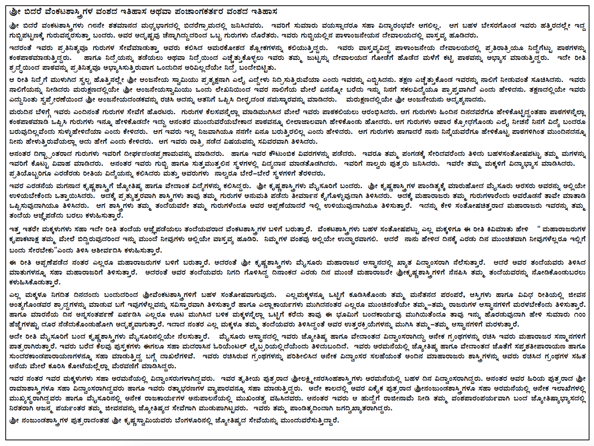

# Panchanga

This site is to share the books and writings of Sri. B.K. Hari Shastry on various topics related to Vedic/Hindu Astrology in Kannada language, including the Panchanga (Hindu Calendar or Almanac) written every year by the same author.

Please share this site link with your friends, family members and other seekers of knowledge. 

### 2019-2020 Kannada Panchanga

[Sri Vikari Samvatsara Sringeri Sri Sharada Panchanga](./files/vikari_sringeri_panchanga.pdf){:target="_blank"} (Download Size: 1.9 MB)

[Sri Vikari Samvatsara Sri Seebi Narasimha Swamy Panchanga](./files/sheebi_pan.pdf){:target="_blank"} (Download Size: 6 MB)

### Other Books & Writings

#### General
1. [Nirayana Ephemeries at 0.00 IST from 2000-2004](./files/sphuta at_0Hr_IST.pdf){:target="_blank"} (Download Size: 2.8 MB)
2. [Rasi Navamsha Padaka Padachara](./files/NEW_raSI_Navamsha_padaka_PADACHARA.pdf){:target="_blank"} (Download Size: 76 KB)

#### Specific to Vikari Samvatsara

1. [Drigganita Rasi Kundali](./files/RASI_vikari.pdf){:target="_blank"} (Download Size: 96 KB)
2. [Drigganita Rasi Kundali](./files/NAVAMSA_vikari.pdf){:target="_blank"} (Download Size: 447 KB)

### About

### Contact

Bidare Prakashana / Sridevi Jyotishalaya
Uttarahalli, Bengaluru

Phone: O - Nine 3 Four 1 Three - One 6 Nine 5 Six

E-mail: bkhshastry AT gmail DOT com

Strictly no consulations over phone/email. Call only between 2pm to 7pm to setup appointment.
